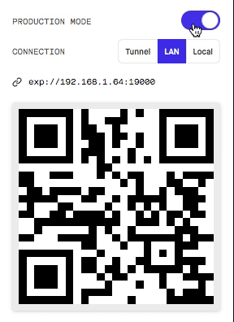

# NewYorkTimesEurisko

This app will get the newest news from the New York Times API

## Installation Android

. Install the Expo application from the Google Play Store  
. A publish application is uploaded to the expo servers
   - Open your Expo application
   - Scan the following QRcode  
     
   
## Installation IOS
 . Since you cant run published application on ios  
 . Open any terminal and go to the root folder after cloning it  

```bash
cd ..<Go to the root app>
```
. In case you dont have the expo installed on your machine run
```bash
npm install --global expo-cli
```
. Then in order to get a QRCODE run
```bash
npm start
```
. The browser will now open automatically with the QRCODE shown  
. Tick the production radio button  
    
. Open the camera application on your IPhone device and scan it  

## Screenshots
<div style="display:inline-block;">
 

<div>
   
## Features 
 . Shareability  
 . Image Transition between the master and the detail  
 . Scroll to refresh  
 . Scroll to the end of the list to load more news  
  


  
 
 
